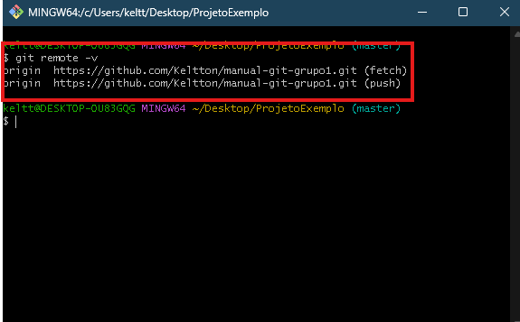

# Comandos Básicos

#### Aqui estaremos falando sobre o básico para o começo em GIT, com exemplos, explicações e imagens!

# Inicialização GIT

## 1. Git init

#### Este comando inicializa um novo repositório do GIT, ele cria uma pasta oculta dentro do seu projeto onde guarda:

* Histórico de Commits
* Referências (Suas branchs e tags)
* Arquivo de configuração do repositório

#### Se ultiliza o git init quando voce está começando um projeto e deseja versioná-lo com GIT. 

## Como Utiliza-lo

1. Na Pasta do seu projeto, abra o Git Bash (Voce pode fazer isso apertando Shift + Botão Direito do Mouse) Veja o exemplo abaixo:

2. Quando apertar esta opção, irá abrir a tela do Git Bash que é parecida com a de um terminal, veja o exemplo abaixo: 

3. Dentro deste "Terminal" Digite "Git Init" (Sem as aspas) e ele iniciará o seu repositório em sue projeto:

* Dentro do seu projeto deve ter criado uma pasta ".git" (É necessário ativar itens ocultos para ve-la):

## Git config

#### o Git config tem várias utilizações, mas falaremos somente das básicas, recomendadas de realizar antes de começar seu projeto

## Git config --global user.name "Seu nome"

#### Este comando define o seu nome de usuário global, ou seja, definirá seu nome para todos os projetos feitos.

* Dentro do Git bash, digite o código 'Git config --global user.name "Seu nome"'(Substitua o "Seu nome" pelo seu nome):

* Note que não houve nenhuma mensagem de confirmação, no final mostro como ver se deu certo

## Git config --global user.email "seuemail@.com"

#### Este comando define o seu email global, ou seja, definirá seu email para todos os projetos feitos.

* Dentro do Git bash, digite o código 'Git config --global user.email "seuemail@.com"'(Substitua o "seuemail@.com" pelo seu email):

* Novamente note que não houve nenhuma mensagem de confirmação, agora vamos verificar estas informações

## Git config --list

#### Este comando irá te mostrar as configurações atuais do GIT

* Dentro do Git bash, digite o código 'Git config --list':

* Este commando irá te trazer uma lista completa de todas as configurações do git, note que as minhas informações de nome e email foram armazenadas

# Repositórios

#### Agora vamos aprender sobre os repositórios

## Git remote add origin "url"

#### Este comando irá linkar o seu projeto local com um projeto remoto, seu objetivo principal é criar uma ponte entre seu projeto local e remoto

* Vejamos como faze-lo no git bash: 

* Agora vamos ver se está linkado mesmo com o repositório local

## Git remote -v 

#### Este comando vai listar todos os repositórios linkados com o projeto

* Utilize o comando "git remote -v" para ver os Rep. linkados com seu projeto:

# Versionamento

#### Agora veremos sobre o versionamento do seu projeto

## Git status

#### Vai mostrar o estado atual dos arquivos (se foram modificados, não rastreados etc)

* Para ver o status dos seus arquivos basta apenas utilizar o comando "git status": 

* Note que diz que os arquivos não estão rastreados, ou seja, falta fazer o "git add"
----
* Se estiver utilizando o VS Code, ele mostrará o status dos arquivos de acordo com a letra ao lado deles:

Letra   | Significado
--------- | ------
"U" | De "Untracked", ou seja, não rastreado,
"M"| De "Modified", ou seja, Arquivo modificado
"A" | De "Added, ou seja, já foi adicionado
"D" | De "Deleted", ou seja, deletado
"R" | De "Renamed", ou seja, Renomeado
"C" | De "Copied", ou seja, copiado
! | Arquivo com conflito de merge

## git add 

#### Este comando adiciona os arquivos que não estão rastreados no staging (preparando para commit), pode ser utilizado de duas formas:

## git add arquivo

* Adicionaa somente o arquivo que está sendo pedido:

## git add .

* Adiciona todos os arquivos que não estão rastreados para staging:

## git commit -m

#### Agora vamos commitar estes arquivos que estavam "staged"

* Para commitar os arquivos é só utilzar o comando 'git commit -m "descrição"'.

* **Lembre-se, é de extrema importância colocar uma descrição completa e coerente com o que foi feito no arquivo, todas as modificações tem que ser ditas aqui, pois na hora que for preciso voltar uma versão no projeto, é está descrição que vai ajudar descobrir o que foi feito.**

## git log

#### É com esse comando que vemos todo o histórico de commits feito no projeto

* É feito com o código "git log" dentro do git bash.

* Como pode ver, este comando traz todas as informações necessárias para se saber o que foi feito, quando foi feito e quem o fez.

# Ultimas considerações

#### Esta pagina é de uso para aprendizado, ensinando sobre os comnandos básicos para se utilizar git em um projeto.

### Lembre-se de sempre colocar suas descrições nos commits!!

## Página feita por Keltton Felipe